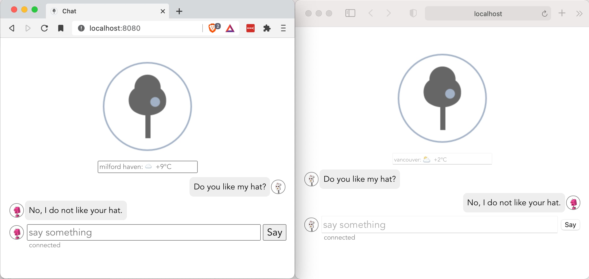

# Realtime Chat Persisted

<p align="center">
  
</p>

This article is the third in the series [Realtime Chat with Vite, Vue3 and Python
Tornado](https://pspddo.medium.com/realtime-chat-with-vite-vue3-and-python-tornado-31c8085253af).
In this article we'll add SQLAlchemy persistence and authentication to our chat app.

So tooling up, we need to add [alembic](https://alembic.sqlalchemy.org/en/latest/)
to our `dev.txt` and [sqlalchemy](https://docs.sqlalchemy.org/en/14/) to our
`requirements.txt`. (NB. At the time of writing SQLAlchemy 1.4.0b3 was in beta
and so the actual entry in `requirements.txt` was `sqlalchemy==1.4.0b3`).

Having done that, we can call `make setup` to install the new packages.

## SQLAlchemy

This package supports two flavours of persistence: an object relational mapper
and an expression language. We'll use the expression language. Create a
module `chat/tables.py` and its contents:
```
""" our sqlalchemy schema """
from sqlalchemy import MetaData, Table, Column, Integer, String, JSON


metadata = MetaData()


user = Table(
    'user',
    metadata,
    Column('id', Integer, primary_key=True),
    Column('email', String(128), nullable=False, unique=True),
    Column('password', String(60), nullable=False),
    Column('profile', JSON),
)
```

How we use this table you'll see further down as we test it before we
use it - test first - after configuration and fixtures - yes, test first.

## Alembic

This package manages the migration of our database in response to changes in
our code. It is a tool used in setup and testing. It plays no part in runtime.
Not all databases support all of its features, but we'll avoid the obvious one,
such as removing a column from a table in sqlite. Alembic is a command line
tool and as such I'll need some additions to `tasks.py` to remember all the
syntax.

## tasks.py
```python
@task
def db_revise(ctx, message, name='chatdb', auto=False):
    """ create a revision """
    autogenerate = ' --autogenerate' if auto else ''
    ctx.run(f'alembic -c setup.cfg --name={name} revision -m {message!r}{autogenerate}')


@task
def db_upgrade(ctx, name='chatdb', revision='head'):
    """ upgrade db """
    ctx.run(f'alembic -c setup.cfg --name={name} upgrade {revision}')


@task
def db_downgrade(ctx, name='chatdb', revision='base'):
    """ downgrade db """
    ctx.run(f'alembic -c setup.cfg --name={name} downgrade {revision}')
```

These are the operations I perform and yet the tools is capable of so much
more. Please check out the [documentation](https://alembic.sqlalchemy.org/en/latest/).

To begin we'll call `alembic init chat/scripts`. This will create a `scripts`
directory inside your `chat` package. Since it has no `__init__.py`, python will
not pick it up at runtime. Since projects can have many packages and this one
has a persistence layer, I see no reason to separate them. Alembic requires
two configuration parameters: the location of the scripts directory and the
sqlalchemy connection url to the database. This information is usually held
in the `alembic.ini`. We can dispose of it and put this information into our
`setup.cfg`:
```
[chatdb]
prepend_sys_path = .
script_location = chat/scripts
sqlalchemy.url = sqlite:///chat.db
```

Now we need to tell `alembic` where to find our `metadata`. Edit
`chat/scripts/env.py` and add this where `target_metadata` is defined:
```
import chat.tables

target_metadata = chat.tables.metadata
```

NB. Since our config provides no logging information, you will need to comment
out line 14 - `#fileConfig(config.config_file_name)`. If we need to set
up logger we can do it later.

Now we can run our task: `inv db-revise -a -m 'first pass'` to autogenerate
a revision and `inv db-upgrade` to bring it up to date.

## Testing

Now test first and weep later - we need to test our database and our
SQLAlchemy table. To do this we'll need to create a test database that
uses alembic to prepare it. So lets first add to our `tests/conftest.py`:

```python
import configparser
from alembic import command
from alembic.config import Config
from sqlalchemy import create_engine

def init_db(name='testdb'):
    """ downgrade and upgrade db """
    config = configparser.ConfigParser()
    config.read('setup.cfg')
    section = config[name]
    db_url = section['sqlalchemy.url']
    alembic_config = Config()
    alembic_config.set_main_option('sqlalchemy.url', db_url)
    alembic_config.set_main_option(
        'script_location', section['script_location']
    )
    if db_url.startswith('sqlite:///'):
        # sqlite does not like downgrading, zap it
        os.unlink(db_url[len('sqlite:///') :])
    else:
        command.downgrade(alembic_config, 'base')
    command.upgrade(alembic_config, 'head')
    return db_url

@pytest.fixture(scope='session')
def test_db():
    """ returns sqlalchemy engine """
    db_url = init_db()
    engine = create_engine(db_url, echo=True, future=True)
    return engine
```

We've stored our scripts and sqlalchemy.url in our `setup.cfg`. To
declare a test database we clone the settings and the `init_db` function
raids those settings to configure alembic. We `downgrade`, `upgrade` and
return the sqlalchemy.url. Then our fixture calls `init_db` and creates
our sqlalchemy engine. So how do we use this?

## tests/test_user.py
```python
""" test our user table """
from sqlalchemy import insert, select, update, delete
from chat.tables import user


def test_create(test_db):
    """ insert admin user """
    with test_db.connect() as conn:
        stmt = insert(user).values(email='admin@test.com', password='admin')
        result = conn.execute(stmt)
        conn.commit()
        assert result.inserted_primary_key[0] == 1

        stmt = select(user).where(user.c.email == 'admin@test.com')
        result = conn.execute(stmt).first()
        assert result.email == 'admin@test.com'


def test_update(test_db):
    """ update admin user """
    with test_db.connect() as conn:
        stmt = select(user).where(user.c.email == 'admin@test.com')
        result = conn.execute(stmt).first()
        print(result)
        assert result.email == 'admin@test.com'
        stmt = (
            update(user)
            .where(user.c.id == result.id)
            .values(profile={'foo': 'bar'})
        )
        result = conn.execute(stmt)
        assert result.rowcount == 1
        conn.commit()

        stmt = select(user).where(user.c.email == 'admin@test.com')
        result = conn.execute(stmt).first()
        assert result.profile == {'foo': 'bar'}


def test_delete(test_db):
    """ let's delete admin """
    with test_db.connect() as conn:
        stmt = delete(user).where(user.c.email == 'admin@test.com')
        result = conn.execute(stmt)
        assert result.rowcount == 1
        conn.commit()

        stmt = select(user).where(user.c.email == 'admin@test.com')
        result = conn.execute(stmt).first()
        assert result is None
```

Running our tests now, `inv test`, should produce and output:

```bash
---------- coverage -----------
Name                Stmts   Miss  Cover   Missing
-------------------------------------------------
chat/__init__.py        0      0   100%
chat/main.py           11      0   100%
chat/tables.py          3      0   100%
chat/websocket.py      19      0   100%
-------------------------------------------------
TOTAL                  33      0   100%
```

We're ready for authentication!

## Authentication

Tornado has the scafolding for Authentication. We'll do a simple
local version and then point to the OAuth variations. Tornado
uses a secure cookie, so we'll need to add settings to our
Application instantiation.

    - cookie_name the name we'll use for our session cookie
    - cookie_secret the phase used to encrypt our cookie
    - login_url where to go to login

Since the command line would become too crowded with all these
options, now is a good to address configuration.

There are so many ways - we've aready used `setup.cfg`, but that is
for development. So let's create a top level directory called `config`
and create ourselves a `config/dev.yml` - not json as it does not
support comments well, not configparser as it does not support dictionaries.
The secret sauce to yml is `waddle` - a config package that support amazon
aws encryption so you can check in your settings and no one can get your
secrets. But that is too much for now, so this prepares for that step and
is simple to setup.

## config/dev.yml
```yml
---
# our settings for sqlalchemy.create_engine
sa:
    url: sqlite:///chat.db
    echo: False
    future: True

# our settings for tornado.we.Application
tornado:
    cookie_name: chat-user
    cookie_sectet: I do like your hat.
    login_url: /login
```

We'll adapt `chat/main.py`:

```python
define('cfg', type=str, default='config/local.yml', help='config path')


def make_app(settings):
    """ make an application """
    engine = create_engine(**settings['sa'])
    return Application(
        [
            (r'/ws', Websocket),
            (r'/login', LoginHandler),
            (
                r'/(.*)',
                tornado.web.StaticFileHandler,
                {'path': 'chat/static', 'default_filename': 'index.html'},
            ),
        ],
        debug=options.debug,
        engine=engine,
        **settings['tornado']
    )


def main():  # pragma nocover
    """ parse command line, make and start """
    parse_command_line()

    with open(options.cfg) as file:
        settings = yaml.safe_load(file)

    app = make_app(settings)
```

Notice, we've added and option for our config file, we've added
settings as a parameter to `make_app`, we've added an `engine`
setting to our application and there is a mysterious `LoginHandler` -
we'll get there soon.

Loading our settings in main is a simple `safe_load`. But `make_app`
is also used in our `tests/conftest.py` - let's update that too:

## tests/conftest.py  - revisited
```python
def init_db(settings):
    """ downgrade and upgrade db """
    db_url = settings['sa']['url']
    alembic_config = Config()
    alembic_config.set_main_option('sqlalchemy.url', db_url)
    alembic_config.set_main_option('script_location', settings['sa_script_location'])
    if db_url.startswith('sqlite:///'):
        # sqlite does not like downgrading, zap it
        os.unlink(db_url[len('sqlite:///') :])
    else:
        command.downgrade(alembic_config, 'base')
    command.upgrade(alembic_config, 'head')

    # load basic data
    engine = create_engine(db_url, future=True)
    with engine.connect() as conn:
        conn.execute(
            text('insert into user (email, password) values ("dog1@test.com","dog1")')
        )
        conn.commit()
    return db_url


@pytest.fixture(name='settings', scope='session')
def load_settings():
    """ return our settings """
    config = configparser.ConfigParser()
    config.read('setup.cfg')
    section = config['testdb']
    return {
        'sa': {'url': section['sqlalchemy.url'], 'echo': False, 'future': True,},
        'sa_script_location': section['script_location'],
        'tornado': {
            'cookie_name': 'test-chat-cookie',
            'cookie_secret': 'test hat wearing',
            'login_url': '/login',
        },
    }


@pytest.fixture(scope='session')
def test_db(settings):
    """ returns sqlalchemy engine """
    db_url = init_db(settings)
    engine = create_engine(db_url, echo=True, future=True)
    return engine


@pytest.fixture
def app(settings):
    """ return a tornado application """
    return make_app(settings)
```

We've added a new fixture, `load_settings`, but we've given it a `name` attribute.
This is to not conflict the namespace and keep our linter from jumping up and
down at the bottom of the screen. As a parameter it is called `settings` and
pytest is clever enough to make this possible. Our app is using settings and
our test_db is using settings and settings is using `setup.cfg`. Our settings
have a non-production addition of the alembic script location - and our production
namespace is safe - no alembic. We've also created a user so we can test cookies!

So having done configuration we can write a login handler!

## login.py
``` python
""" our login handler """
import json
import logging
from sqlalchemy import select
from tornado.web import RequestHandler, HTTPError
from . import tables

log = logging.getLogger(__name__)


class UserMixin:
    """ for use by authenticated handlers """

    @property
    def cookie_name(self):
        """ return the cookie_name declared in application settings"""
        return self.settings.get('cookie_name')

    def get_current_user(self):
        """ return the current user from the cookie """
        result = self.get_secure_cookie(self.cookie_name)
        if result:
            result = json.loads(result.decode('utf-8'))
        return result


class LoginHandler(UserMixin, RequestHandler):
    """ handle login get and post """

    def get(self, error=None):
        """ render the form """
        email = self.get_argument('email', default=None)
        next_ = self.get_argument('next', '/')
        self.render(
            'login.html', email=email, error=error, next=next_,
        )

    async def post(self):
        """ handle login post """
        try:
            email = self.get_argument('email', None)
            password = self.get_argument('password', None)
            submit = self.get_argument('submit', 'login')
            if email is None or password is None:
                raise HTTPError(403, 'email or password is None')
            user = None
            if submit == 'login':
                user = await self.login(email, password)
            if user:
                self.set_secure_cookie(self.cookie_name, json.dumps(user))
                self.redirect(self.get_argument('next', '/'))
            else:
                raise Exception('email or password incorrect')
        except Exception as ex:  # pylint: disable=W0703
            log.exception(ex)
            self.get(error=str(ex))

    def login(self, email, password):
        """ can we login ? """
        user = None
        engine = self.settings['engine']
        with engine.connect() as conn:
            stmt = select(tables.user).where(
                tables.user.c.email == email, tables.user.c.password == password,
            )
            row = conn.execute(stmt).first()
            if row:
                user = {'id': row.id, 'email': row.email}
        return user
```

Now we need to update our websocket with the `UserMixin` and reject unauthenticated requests.

```python
class Websocket(UserMixin, WebSocketHandler):
    """ a websocket handler that broadcasts to all clients """

    ...

    def open(self, *args, **kwargs):
        """ we connected """
        if self.current_user is None:
            self.close(401, 'not authenticated')
            return
        email = self.current_user['email']
        log.info('WebSocket opened: %s', email)
        self.write_message(email)
        self.clients.append(self)

    ...

    def on_message(self, message):
        """ we've said something, tell everyone """
        email = self.current_user['email']
        message = json.dumps({'user': email, 'message': message})
        for client in self.clients:
            client.write_message(message)
```

On open we send back the user's email - this allows us to get rid of the input for user in our vue component. We also create a json message when someone says something.

And now we need to specialize the StaticFileHandler:

```python
class AuthStaticFileHandler(UserMixin, StaticFileHandler):
    """
    This provide integration between tornado.web.authenticated
    and tornado.web.StaticFileHandler.
    """

    def initialize(self, allow=None, **kwargs):  # pylint: disable=W0221
        """ allow some paths through """
        super().initialize(**kwargs)
        self.allow = allow if allow else []  # pylint: disable=W0201

    async def get(self, path, include_body=True):
        """ safe to return what you need """
        if self.current_user is None and path not in self.allow:
            return self.not_authenticated()
        return await StaticFileHandler.get(self, path, include_body)

    def not_authenticated(self):
        """ raise a redirect or error, tornado code dug out of a wrapper """
        url = self.get_login_url()
        if '?' not in url:
            if urllib.parse.urlsplit(url).scheme:
                # if login url is absolute, make next absolute too
                next_url = self.request.full_url()
            else:
                assert self.request.uri is not None
                next_url = self.request.uri
            url += '?' + urlencode(dict(next=next_url))
        self.redirect(url)
```

We pass in a list of allowable paths because `favicon.ico` is called even for the login page, and we might want a `robots.txt`, etc. So back in `main.py` we need a new route definition.

```python
(
    r'/(.*)',
    AuthStaticFileHandler,
    {
        'path': 'chat/static',
        'default_filename': 'index.html',
        'allow': ['favicon.ico'],
    },
)
```

So now we can serve static file, respond to authenticated websocket requests,
login and oh! We need a `login.html` and Vue will not provide that! If you
scan back you'll notice that the LoginHandler.get function renders a 'login.html'.
Tornado will render a template and if you don't specify a template path it will
look beside the handler module for the template document. Our's looks like this:

## login.html
```html
<form action="/login" method="post">
    <h1>Chat Login</h1>
    <div class="column">
        <input type="email" name="email" value="{{ email or '' }}" placeholder="email" autofocus>
        <div class="sep"></div>
        <input type="password" name="password" value="" placeholder="password">
        <div class="sep"></div>
        <input type="submit" name="submit" value="login">
        <div class="sep"></div>
        <input type="hidden" name="next" value="{{ next }}">
    </div>
    
    <div class="error">
        {{ error }}
    </div>
    
</form>
```

This is using the built-in template language. Double curly braces get python time.
It is a simple language and you can make really complicated sites with it - I know,
my customers have said so. But it does the job.

## Refactoring Vue Client

We need to refactor our vue client starting with our `websocket.js`.

```javascript
const ws = new WebSocket(ws_url);
ws.state = reactive({
    status: "connecting",
    email: "",
    transcript: []
})
ws.onopen = function () {
    ws.state.status = "connected"
}
ws.onmessage = function (evt) {
    if (ws.state.email == "") {
        ws.state.email = evt.data
    } else {
        ws.state.transcript.push(JSON.parse(evt.data))
    }
};
ws.onclose = function () {
    ws.state.status = "disconnected"
}
```

We now have a reactive state object with: status, email and transcript. So now
our vue component can be refactored as `Chat.vue`:

```html
<Weather class="weather" />
<div class="transcript" ref="transcript">
    <div class="line" v-for="(line, idx) in transcript" :key="idx">
        <template v-if="line.user == email">
            <UserImage :email="line.user" class="circle" v-if="line.user == email" />
            <div class="message">{{ line.message }}</div>
            <div class="spacer"></div>
        </template>
        <template v-else>
            <div class="spacer"></div>
            <div class="message">{{ line.message }}</div>
            <UserImage :email="line.user" class="circle" v-if="line.user != email" />
        </template>
    </div>
</div>
<form @submit.prevent="say">
    <UserImage :email="email" class="circle" v-if="email" />
    <input type="text" v-model="something" placeholder="say something" />
    <input type="submit" value="Say" />
</form>
<div class="status">
    {{ status }}
</div>
```

Because our transcript is now an array of objects we can use the information
to put messages from me to the left and messages from others to the right. What
is a UserImage - it's just a component to display `gravatar` of the email
address. I've also added a `weather.vue` - it's an input where the placeholder
is the `wttr.in` information for a location. The default location is 'Haverford West',
but input a value and hit enter - the placeholder will be changed to the
weather there. I hear you thinking - that could be a preference! You are way
ahead of me.

Our `script` has been refactored too:

```javascript
import UserImage from './user_image.vue'
import Weather from './weather.vue'
export default {
    components: {
        UserImage,
        Weather
    },
    data() {
        return {
            something: ""
        }
    },
    computed: {
        email() {
            return this.$ws.state.email
        },
        transcript() {
            return this.$ws.state.transcript
        },
        status() {
            return this.$ws.state.status
        }
    },
    methods: {
        say() {
            this.$ws.send(this.something)
            this.something = ""
        }
    },
    watch: {
        transcript: {
            handler(val) {
                setTimeout(() => {
                    this.$refs.transcript.scrollTop = this.$refs.transcript.scrollHeight
                }, 100)
            },
            deep: true
        }
    }
}
```

So what do our tests look like?

## tests/test_ws.py

```python
""" test websocket client """
import asyncio
import json
from tornado.httpclient import HTTPClientError


async def test_no_auth_ws(ws_client):
    """ test we need to authenticate """

    client = await ws_client
    response = await client.read_message()
    assert response is None, 'nothing to read - is closed'


async def test_ws(ws_auth_client):
    """ test message send and receive """

    message = 'hello, world'

    client = await ws_auth_client
    response = await client.read_message()
    assert response == 'dog1@test.com'
    await client.write_message(message)
    response = await client.read_message()
    print(response)
    assert response == json.dumps({'user': 'dog1@test.com', 'message': message})

    client.close()
    await asyncio.sleep(0.01)


async def test_ws_cors_failure(ws_bad_client):
    """ test message send and receive """

    try:
        await ws_bad_client
        assert False, 'should have returned 403'
    except HTTPClientError as ex:
        assert ex.code == 403


async def test_ws_cors_success(ws_bad_client, app):
    """ test message send and receive """

    message = 'hello, world'
    app.settings['debug'] = True
    client = await ws_bad_client
    response = await client.read_message()
    assert response == 'dog1@test.com'
    await client.write_message(message)
    response = await client.read_message()
    print(response)
    assert response == json.dumps({'user': 'dog1@test.com', 'message': message})

    client.close()
    await asyncio.sleep(0.01)
```

We have a new fixture: `ws_auth_client`.

```python
@pytest.fixture(name='cookie')
async def get_cookie(settings, http_server, http_server_client):
    """ login to get a cookie """
    response = await http_server_client.fetch(
        settings['tornado']['login_url'],
        headers={
            'Content-type': 'application/x-www-form-urlencoded',
            'Accept': 'text/plain',
        },
        method='POST',
        body=urllib.parse.urlencode(
            {'email': 'dog1@test.com', 'password': 'dog1', 'submit': 'login'}
        ),
        follow_redirects=False,
        raise_error=False,
    )
    print(response)
    return response.headers['Set-Cookie']

@pytest.fixture
async def ws_auth_client(http_server, http_server_port, cookie):
    """ return a websocket client """
    request = HTTPRequest(
        f'ws://localhost:{http_server_port[1]}/ws', headers={'Cookie': await cookie},
    )
    result = await websocket_connect(request)
    return result
```

This allows us to authenticate via cookie with the credentials we created
after upgrading the test database.

And testing our static file handler:

```python
""" test our static file handler """


async def test_favicon(http_server_client):
    """ can we get favicon without login """
    resp = await http_server_client.fetch('/favicon.ico')
    assert resp.code == 200


async def test_index_page(http_server_client, http_server_port, app):
    """ can we get favicon without login """
    resp = await http_server_client.fetch(
        '/', follow_redirects=False, raise_error=False
    )
    assert resp.code == 302

    app.settings['login_url'] = f'http://localhost:{http_server_port}/login'

    resp = await http_server_client.fetch(
        '/index.html', follow_redirects=False, raise_error=False
    )
    assert resp.code == 302

    app.settings['login_url'] = '/login'
```

Testing results in:

```bash
---------- coverage: platform darwin, python 3.8.7-final-0 -----------
Name                     Stmts   Miss  Cover   Missing
------------------------------------------------------
chat/__init__.py             1      0   100%
chat/login.py               50      0   100%
chat/main.py                18      0   100%
chat/static_handler.py      21      0   100%
chat/tables.py               3      0   100%
chat/websocket.py           28      0   100%
------------------------------------------------------
TOTAL                      121      0   100%
=========================== 12 passed in 0.78s =======================
```

But, does it work? The image at the top of the screen is proof it works
on my machine from docker. **NB.** *I could not get alpine to work with `greenlets`,
for less than the cost of `buster` - the Dockerfile uses:
`FROM python:3-slim-buster as base` and builds as 137MB*

If you have got this far, checkout the code as
it's got some added documentation and I've left inline comments for
gotchas. It's been a long haul - but there are some things to mention.

How do you register users? I've got a task for that:

```python
@task
def register(_, email, password, name='chatdb'):
    """ load settings, create engine and insert user """
    import configparser
    from sqlalchemy import create_engine, insert
    from chat import tables

    config = configparser.ConfigParser()
    config.read('setup.cfg')
    engine = create_engine(config[name]['sqlalchemy.url'], future=True)
    with engine.connect() as conn:
        conn.execute(
            insert(tables.user).values(email=email, password=password)
        )
        conn.commit()
```

Or you could allow users to register? Or we could implement OAuth2 and
users could register via our provider.

Tornado is an asynchronous server and we're using synchronous access to a
sqlite db. This is not wrong, it just not scalable. Our database is locked
away in our container and oops - it gone! So how do we scale? That's another
article - the fourth in the series!


The source is on [https://github.com/blueshed/chat/tree/article3
](https://github.com/blueshed/chat/tree/article3)
