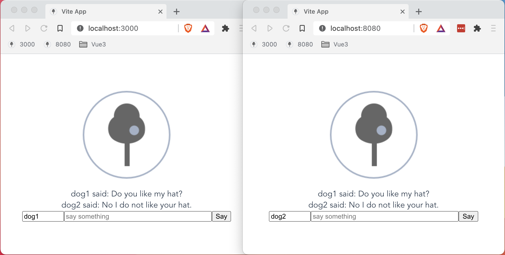
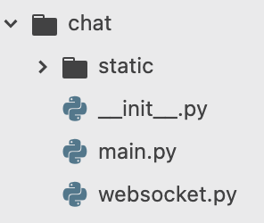
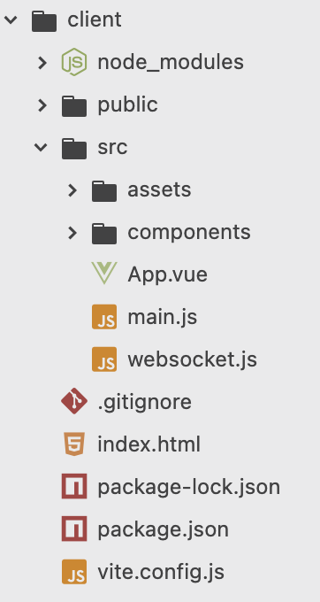
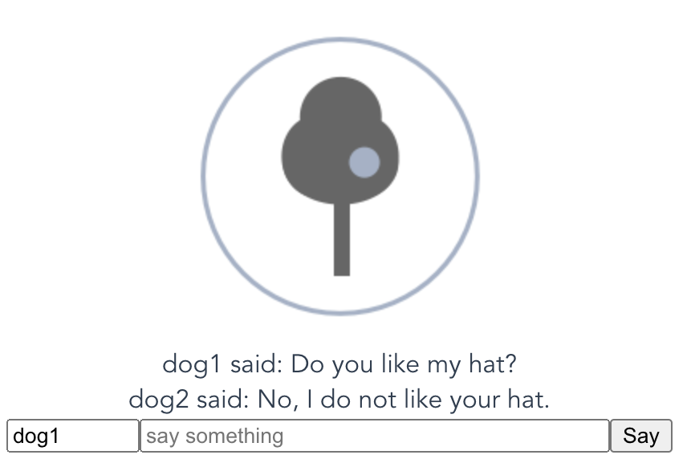
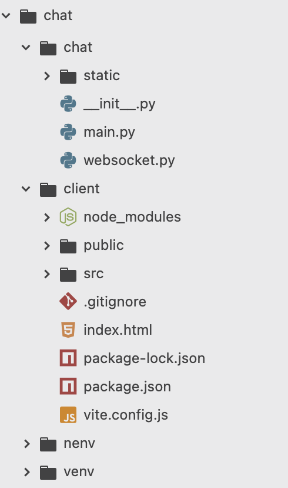

# Realtime Chat with Vite, Vue3 and Python Tornado

<p align="center">
  
</p>

I love [Vue](https://v3.vuejs.org/guide/introduction.html) and
[Vite](https://vitejs.dev/guide/) - what a wonderful development experience. But
I love python for its [Tornado](https://www.tornadoweb.org/en/stable/), SQLAlchemy
and so much more. So here is a tip of the iceberg - this demonstrates the nexus
along with outrageous misuse of tools and bad engineering - where is the linting,
formating, testing, documentation and the rest? If asked I can drum up the
pylint, axblack, pytest, sphinx, but I won't use rest; rpcs for me.

To start we create a Makefile - its steps are simple if you don't have Make:

- create a virtual environment called venv
- activate and install nodeenv and tornado
- create a node virtual environment called nenv

## Makefile

```bash
    setup:
    	if which python3 && [ ! -d venv ] ; then python3 -m venv venv ; fi
    	source venv/bin/activate \
    		&& python -m pip install -q -U pip \
    		&& pip install nodeenv tornado \
    		&& if [ ! -d nenv ] ; then nodeenv nenv ; fi
```

Then call your Makefile's setup function:
```
    make setup
```

Create a python package called `chat` and add modules to it called `main.py` and
`websocket.py`. To the package add a directory called `static` which will house
our web static files.

<p align="center">
  
</p>

In bash you could run:
```bash
    mkdir chat
    touch chat/__init__.py
    touch chat/main.py
    touch chat/websocket.py
    mkdir chat/static
```


Main will hold our `tornado` configuration and `websocket` define our websocket
handler. Tornado instantiates RequestHandler classes to handler each request.
We'll use two handlers: Websocket and StaticFileHandler.

## websocket.py

```python
""" our websocket handler """
import logging
from tornado.websocket import WebSocketHandler

log = logging.getLogger(__name__)


class Websocket(WebSocketHandler):
    """ a websocket handler that broadcasts to all clients """

    clients = []

    def check_origin(self, origin):
        """ in development allow ws from anywhere """
        if self.settings.get('debug', False):
            return True
        return super().check_origin(origin)

    def open(self, *args, **kwargs):
        """ we connected """
        log.info('WebSocket opened')
        self.clients.append(self)

    def on_close(self):
        """ we're done """
        if self in self.clients:
            self.clients.remove(self)
        log.info('WebSocket closed')

    def on_message(self, message):
        """ we've said something, tell everyone """
        for client in self.clients:
            client.write_message(message)

```
You'll find tornado's documentation for websockets [here](https://www.tornadoweb.org/en/stable/websocket.html).

Our specialisation add a class property `clients` to which each request adds to
and removes from themselves. This allows us to broadcast on receipt of a message.
We check the debug setting to see if we allow request from other origins. We
are going to be accessing this websocket from the Vite server on port 3000. Without
the `check_origin` method tornado would return a 403 error.

## main.py

```python
""" our entry point """
import logging
import tornado.ioloop
from tornado.web import Application
from tornado.options import define, options, parse_command_line
from .websocket import Websocket

log = logging.getLogger(__name__)

define('debug', type=bool, default=False, help='auto reload')
define('port', type=int, default=8080, help='port to listen on')


def make_app():
    """ make an application """
    return Application(
        [
            (r'/ws', Websocket),
            (
                r'/(.*)',
                tornado.web.StaticFileHandler,
                {'path': 'chat/static', 'default_filename': 'index.html'},
            ),
        ],
        debug=options.debug,
    )


def main():
    """ parse command line, make and start """
    tornado.options.parse_command_line()
    app = make_app()
    app.listen(options.port)
    log.info('listening on port: %s', options.port)
    if options.debug:
        log.warning('running in debug mode')
    tornado.ioloop.IOLoop.current().start()


if __name__ == '__main__':
    main()
```

Tornado provides an args parser and with it we define two options: port and debug.
We then make an app by defining routes and settings. Routes specify path, handler and
initialisation options. Our Websocket has no options, but the StaticFileHandler needs
to know a path for the files, and a default filename, should a filename not be in
the request. Using our debug option we can activate tornado hot-reload and we'd do
this on the command line by specifying `--debug=true`.

Tornado is an asynchronous framework and so we start its ioloop. It is now written
atop the standard library asyncio package with a few excellent extras.

So now we have a tornado application we can run it from the command line by
activating our virtual environment and calling our main module:
```
    . venv/bin/activate
    python -m chat.main --debug=true
```

## Vite

First we need to activate our nodeenv and then call Vite to create an app.
```
    . nenv/bin/activate
    npm init @vitejs/app client
```

This will ask to install Vite and ask what flavour of app you want. We'll
choose regular Vue. It will then instruct you to move to the client directory
and run `npm install` and `npm run dev`. Do so. Now on port 3000 you should
find your Vite Vue3 app. Let's add a Websocket client:

<p align="center">
  
</p>

## websocket.js
```javascript
import {
    reactive
} from 'vue'

export default {
    install: (app, options) => {
        const ws = new WebSocket("ws://localhost:8080/ws");
        ws.transcript = reactive([])
        ws.onmessage = function (evt) {
            ws.transcript.push(evt.data)
        };
        app.config.globalProperties.$ws = ws
    }
}
```

We create a WebSocket back to our tornado app. We also have a transcript
attribute that is `reactive`. We install ourselves as a plugin, giving global
access to $ws in any vue component. Each websocket message will be added to
our transcript attribute. Though not visible here, the Websocket has a `send`
method, which takes a string message parameter. We'll use this in the
HelloWorld.vue `say` method.

Then in `main.js`...

## main.js
```javascript
import {
    createApp
} from 'vue'
import App from './App.vue'
import ws from './websocket.js'

const app = createApp(App)
app.use(ws)
app.mount('#app')
```

We add our plugin to the app with `app.use(ws)`. Otherwise this is as
it came from the template project.

Then we change `components/HelloWorld.vue` to use our plugin:

## HelloWorld.vue
```html
<template>
<div class="page">
    <div class="transcript">
        <div class="line" v-for="line in $ws.transcript">
            {{ line }}
        </div>
    </div>
    <form @submit.prevent="say">
        <input type="text" v-model="name" placeholder="your name" size="10">
        <input type="text" v-model="something" placeholder="say something" size="40">
        <input type="submit" value="Say">
    </form>
</div>
</template>
```

Our template is a simple column, with transcript and entry. Our transcript
is an iteration of the $ws.transcript reactive attribute. Our entry is
a row of inputs for name, something and a submit button. Our form has a
submit event handler which prevents the default behaviour - as in, it does not
make a request and reload the page.

```javascript
export default {
    data() {
        return {
            name: "anon",
            something: ""
        }
    },
    methods: {
        say() {
            this.$ws.send(`${this.name} said: ${this.something}`)
            this.something = ""
        }
    }
}
```

Yes, I know I did not use the composition api. This is still readable and
as I get used to the composition api I will move over. This comes out of
my fingers by itself... We have two reactives and a method. The method
is called by the form event and we format a string and send it via the
websocket. We then reset the something input.

```css
.page {
    display: flex;
    flex-direction: column;
}

.form {
    display: flex;
    flex-direction: row;
}

.transcript {
    display: flex;
    flex-direction: column;
}
```
The css provides columns and rows using `flex`.

Other than that, I've replaced the logo with a picture so as not to let
any of my mistakes or sloppiness be associated with Vite, Vue or Tornado.

And this is the result:

<p align="center">
  
</p>

You should be able to see it on:
```
    http://localhost:3000
```

Next, we'll build our app and access it via port 8080. First, we need to
edit the `client/package.json` to tell Vite where to put the built files.
```json
    "build": "vite build --outDir=../chat/static/ --emptyOutDir",
```

Then run the build command in a new terminal:
```bash
    . nenv/bin/activate
    cd client
    npm run build
```

Now you should be able to point your browser to:
```
    http://localhost:8080
```

Tornado is serving both the client and the websocket. Check out the size of the
client! For me it is 59k! (the size of the static directory).

If you are still running Vite on port 3000, using two browser pages, you
can chat between Vite and Tornado, dev and built!

Placed in a docker container, with multi-stage build, will result in a 48MB image!

This is just the beginning. On from here, we find docker containers, database
access through SQLAlchemy, Redis to support multiprocess communication, remote
procedure calls to provide views, caching for search and so much more, all made
possible by a simple ioloop running testable functions.

<p align="center">
  
</p>

The project is available at:
[https://github.com/blueshed/chat/tree/article1](https://github.com/blueshed/chat/tree/article1)
